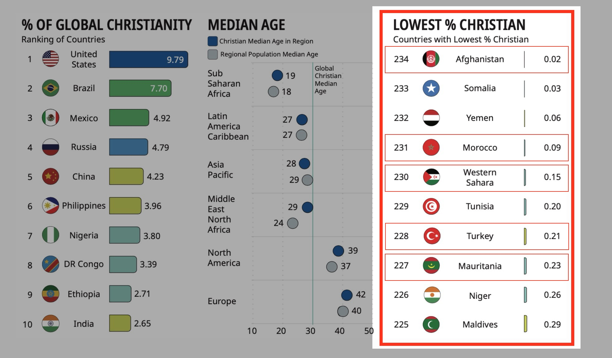
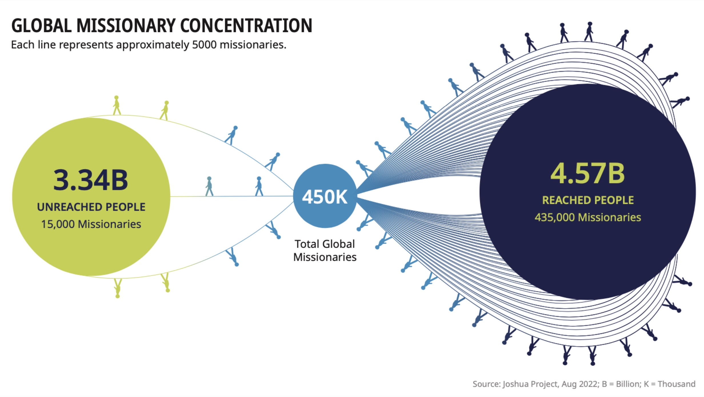

# 세계 선교 현황

### 1. 예수님의 지상 대명령
> 예수께서 나아와 말씀하여 이르시되 하늘과 땅의 모든 권세를 내게 주셨으니
> 그러므로 너희는 _**가서**_ **모든 민족을 제자로 삼아** 아버지와 아들과 성령의 이름으로 **_세례를 베풀고_**
> 내가 너희에게 분부한 모든 것을 **_가르쳐 지키게 하라_** 볼지어다 내가 세상 끝날까지 너희와 항상 함께 있으리라 하시니라 - 마태복음 28:18-20

1. _**가서**_: 가지 않으면 복음을 듣지 못하는 이들이 너무 많다
2. 모든 민족을 제자로 삼아
3. 세례를 베풀고 가르켜 지키게 하라

**👉 선교는 교회 개척이다 ✝️**

### 2. 세계 기독교 현황
복음화율이 낮은 국가에 관심과 노력이 필요

개신교 중심이 아닌, 광범위한 신학 포용력 필요 🌍

미전도 종족 세부 분석 ➡️ 아프리카, 남아시아, 무슬림, 힌두교도로 관심 필요

### 3. 세계 기독교 성장
명령은 **불변**, 상황은 **만변**

### 4. 세계 선교사 파송 현황
이미 복음을 접한 이들에게 파송이 이루어지고 있다 🤦‍♂️ 선교사 파송의 재분배 및 재조정이 필요 🔄

### 5. 한국 기독교 및 선교사 파송 현황
선교사 고령화 👴👵 및 아시아 파송 집중화가 지속됨

### 6. 미국 기독교 현황

### 7. 해석과 적용
**지상 대명령** (The Great Commission) 을 실현하는 **선교 대계획** (The Great Vision) 수립
> "세계 기독교의 미래는 아프리카에 있다" - 필립 젠킨스(Philip Jenkins)

> "1세기부터 지금까지 세계 선교의 중심에는, 지역 교회(local churches) 와 선교 단체(mission agencies)의 협력이 있어왔다." - Yaw Perbi & Sam Ngugi

> "예수님은 여전히 왕이시다. 그분의 선교는 반드시 성취될 것이다." – 제인 프랫 (Zane Pratt)

